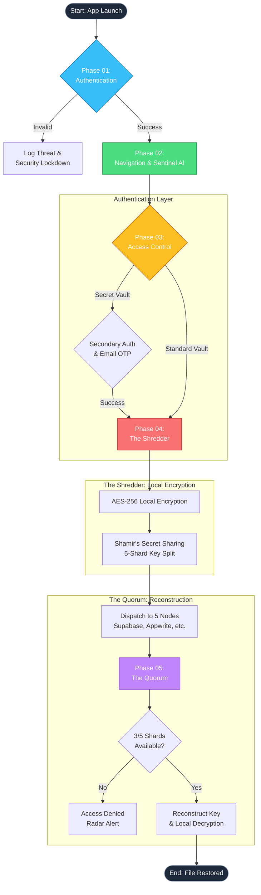

<div align="center">
  
# 🛡️ FRACTAL VAULT
**Absolute Digital Sovereignty & Mathematical Invincibility**

[](https://flutter.dev/)
[](https://firebase.google.com/)
[](https://deepmind.google/technologies/gemini/)
[](#)

[](https://fractal-vault.web.app/)

*Built for the Google Solution Challenge 2026 by Team Dual Cortex*

</div>

---
## 🌐 Official Web Portal & Live Demo

Experience the zero-knowledge architecture firsthand. Explore the system documentation, view the architectural diagrams, and download the compiled operative payload (APK) directly from our live hosted portal:

🔗 **[Access the Fractal Vault Portal Here](https://fractal-vault.web.app/)**

## 📜 1. Mission Briefing
The modern digital landscape is plagued by "Single Point of Failure" vulnerabilities. Traditional cloud storage relies on centralized databases; if a single server is breached, or a user's password is stolen via phishing, their entire digital life is compromised. **Fractal Vault** completely eliminates this paradigm. 

We do not just encrypt your files—we shatter the encryption keys into mathematical fragments using **Shamir's Secret Sharing (SSS)**. These shards are then scattered across a diverse, decentralized grid of competing global cloud providers. Managed by an autonomous, Gemini-powered "System A.I." known as the *Sentinel*, Fractal Vault guarantees **Zero-Knowledge** security and **Hardware-Bound** access. 

Your data isn't just hidden behind a firewall; it is mathematically non-existent to the outside world.

---

## 🧠 2. Core Architecture: The Sharding Engine

### The 3/5 Cryptographic Quorum
When a file is secured in the vault, it undergoes a complex, two-step cryptographic process directly on the client's local hardware before it ever touches an internet connection:

1. **AES-256 Local Lock:** The heavy payload (the file itself) is encrypted locally using military-grade AES-256 encryption.
2. **Fractal Sharding (Polynomial Cryptography):** The AES Master Key is then passed through a polynomial equation to generate `n=5` distinct mathematical fragments.
3. **Decentralized Dispersion:** The shards are asynchronously dispatched to 5 completely independent nodes:
   * 🟢 `Node 1:` **Supabase** (PostgreSQL)
   * 🟢 `Node 2:` **Appwrite** (Storage Buckets)
   * 🟢 `Node 3:` **Cloudinary** (Media Buckets)
   * 🟢 `Node 4:` **ImageKit** (Media Buckets)
   * 🟢 `Node 5:` **Local Hardware** (Device Fingerprint/Secure Enclave)

**The Fault-Tolerant Quorum:** To reconstruct the file, the system only requires `k=3` shards. This provides supreme fault tolerance. 
* If two massive cloud providers experience catastrophic outages, your data remains fully accessible. 
* Conversely, if a hacker manages to breach four of the cloud nodes simultaneously, your key remains mathematically impossible to reconstruct without the physical, local device you hold in your hand.

---

## ⚙️ 3. Tactical Feature Stack

### 🤖 The Sentinel (Gemini 2.5 Flash AI)
Fractal Vault is guarded by an integrated autonomous cyber-guardian. The Sentinel is constrained by strict System Instructions to reject conversational banter and focus solely on operational security.
* **Real-Time Telemetry:** The AI can initiate live HTTP ping sweeps across the global nodes, calculating Quorum health and diagnosing latency issues.
* **Function Calling:** You can command the AI via natural language (e.g., *"Go dark"*) to execute physical app changes like triggering Stealth Mode.
* **Zero-Knowledge Briefings:** The AI guides the user on their cryptographic posture without ever having access to the unencrypted files.

### 🛡️ Defense-in-Depth UI Modules
* **CORE (Dashboard):** The primary command center for viewing recent shattered records and monitoring system integrity.
* **VAULT (Storage Sector):** A dual-layer storage module. It features a public-facing standard vault and a hidden **Secret Vault** that requires secondary biometric verification and Email OTP fallbacks to access.
* **RADAR (Telemetry):** The system's active perimeter monitor. It tracks node health and permanently logs all authorization attempts (including capturing details of blocked breaches).
* **SYSTEM (Protocols):** The configuration center featuring **Stealth Mode**—a UI-level obfuscation protocol that instantly masks the vault's contents from external observation and the device's OS-level app switcher.

---

## 🏗️ 4. Technical Stack

| Category | Technology | Purpose |
| :--- | :--- | :--- |
| 📱 **Frontend** |  <br> **Dart** | High-performance, cross-platform UI with "Glassmorphic" terminal aesthetics and Local Cryptographic Engine execution. |
| ☁️ **Orchestration** |  <br> **Cloud Functions** | Secure identity management, Cloud Firestore for encrypted metadata (doc_ids), and Serverless OTP delivery. |
| 🧠 **AI Integration** |  <br> **Gemini 2.5 Flash** | Powers the Sentinel AI via the `google_generative_ai` SDK, utilizing advanced Function Calling for system controls. |
| 🗄️ **Storage Nodes** |   <br> **Cloudinary / ImageKit** | The independent, decentralized architecture that houses the fragmented AES-256 Key shards. |
| 🌐 **Web Presence** |  | High-speed global deployment of the architectural landing page and project documentation. |

---

## 🚀 5. System Lifecycle

The operational flow of Fractal Vault is rigidly divided into 5 core phases:

---

## 🛠️ 6. Installation & Setup

> ⚠️ **IMPORTANT NOTE FOR JUDGES & USERS:**
> 
> **End-Users do NOT need API keys.** If you are simply testing the app, download the fully compiled APK from our landing page. The production application comes with all decentralized infrastructure securely compiled. 
>
> **Why are API keys required below?** This setup guide is strictly for open-source contributors, judges, or security auditors who wish to build the project from the raw source code. Providing your own `.env` ensures you can test the cryptography in a completely isolated environment, proving the Zero-Knowledge architecture of our system.

**1. Clone the Repository:**
```bash
git clone [https://github.com/acakefromdafuture3/fractal-vault.git](https://github.com/acakefromdafuture3/fractal-vault.git)
cd fractal-vault
```

**2. Install Dependencies:**
```bash
flutter pub get
```

**3. Configure Environment Variables:**
Create a `.env` file in the root directory. You must supply your own project endpoints to compile the source code:
```env
GEMINI_API_KEY=your_gemini_api_key
SUPABASE_URL=your_supabase_url
SUPABASE_SERVICE_ROLE=your_supabase_key
APPWRITE_ENDPOINT=your_appwrite_endpoint
APPWRITE_PROJECT_ID=your_appwrite_project
APPWRITE_API_KEY=your_appwrite_api_key
APPWRITE_BUCKET_ID=your_appwrite_bucket
CLOUDINARY_CLOUD_NAME=your_cloudinary_name
CLOUDINARY_API_KEY=your_cloudinary_key
CLOUDINARY_API_SECRET=your_cloudinary_secret
IMAGEKIT_URL_ENDPOINT=your_imagekit_endpoint
IMAGEKIT_PRIVATE_KEY=your_imagekit_key
```

**4. Run the Application:**
```bash
flutter run
```

---

## 👥 The Operators (Team Dual Cortex)

* **Ritankar Bose** - *Lead Architect & Cryptography Developer*
* **Rani Bhattacharjee** - *Frontend Systems & UX Integration*

*Designed with 💙 for the Google Solution Challenge 2026.*
